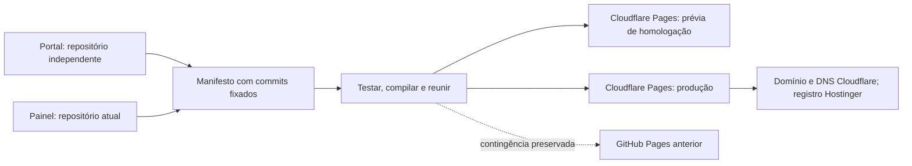

# Operação da expansão modular

## Estado e limites

Atualização de autorização em 08/10/2026: o usuário solicitou a migração para Cloudflare e a reorganização do domínio. O plano ativo e os requisitos de transição estão em [CLOUDFLARE.md](CLOUDFLARE.md). As restrições de calendário descritas abaixo registram a etapa anterior; não substituem essa nova autorização. O workflow GitHub atual permanece preservado como origem de contingência.

Implementação em branch de desenvolvimento e repositórios separados. Pacote integrado publicado no Cloudflare Pages Free; domínio principal ativo e verificado em 08/10/2026, após delegação autorizada. DNS é administrado pela Cloudflare; registro e renovação permanecem na Hostinger. O workflow atual `deploy-pages.yml` continua preservado no GitHub para publicar o painel original na raiz; ele não publica o compositor. Estado de domínio e certificados, versões aprovadas e instruções Cloudflare estão em [CLOUDFLARE.md](CLOUDFLARE.md).

Portal mínimo: início, painel, catálogo, Sobre e encaminhamento aos mapas existentes. Rede, Boletins e Análises têm estado explícito de preparação. Sua elaboração depende de conteúdo autorizado. A hospedagem Cloudflare recebe um pacote estático único; backend não faz parte desta implementação.

## Arquitetura



O pacote contém `/`, `/painel-de-monitoramento/`, `/mapas-de-saude/`, `/rede-de-saude/`, `/boletins/`, `/dados/`, `/analises/` e `/sobre/`. O painel preserva seus fragmentos internos `#/aps`, etc. O portal reconhece links antigos conhecidos e preserva parâmetros; fragmentos não chegam ao servidor. Cloudflare usa base `/` em homologação e produção. O ambiente GitHub Pages preservado usa base `/sala-situacao-unai-homologacao/`.

## Gerar localmente

Node.js 22, Git e dependências do painel instaladas via `npm ci`. No checkout de desenvolvimento:

```sh
node scripts/compose-site.mjs --portal=../portal --legacy=../../sala-situacao-unai-v2/dist --base=/ --environment=homologacao
```

`--portal` é opcional: sem ele o compositor busca o commit público fixado em `modules.json`. O caminho legado deve apontar ao `dist` preservado de 109d7d5, jamais à compilação nova. Saída: `dist-ecossistema/`. Para o endereço de homologação, usar `--base=/sala-situacao-unai-homologacao/`. O compositor executa os testes antes de compilar, verifica links estáticos, compara os cinco JSON byte a byte e registra hashes e commits em `build-info.json`. Requer comandos Node sem shell. Não publicar `.sources`, `src`, backups ou a raiz do repositório.

Não usar pacote gerado com mudanças locais não commitadas como versão aprovada. `build-info.json` identifica commits, não captura modificações não commitadas. O workflow usa checkouts limpos e commits completos.

## Publicar homologação

Para a hospedagem Cloudflare ativa, seguir **Atualizar a publicação** em [CLOUDFLARE.md](CLOUDFLARE.md): testar `ambiente=homologacao`, depois publicar a mesma referência com `ambiente=producao`. A sequência abaixo descreve a homologação GitHub Pages preservada como alternativa.

1. Atualizar o módulo em seu repositório e aprovar seu commit.
2. Alterar a referência SHA de 40 caracteres em `modules.json` por PR.
3. Confirmar testes do publicador e portal; nenhuma alteração de `main` é necessária para homologar.
4. No repositório `sala-situacao-unai-homologacao`, executar o workflow manual **Homologar ecossistema**, informando o commit completo do publicador.
5. O workflow baixa a versão anterior por URL fixa, verifica SHA-256, executa testes, audit e compositor. Publica somente o pacote integrado no Pages do próprio repositório. Não precisa de token entre repositórios públicos.
6. Conferir versão, aviso de homologação, navegação e dados. Não considerar placeholders módulos completos.

## Acrescentar ferramentas

Manter código independente, saída estática e testes `tests/*.test.mjs`. Criar um comando Node de compilação e definir repositório público, commit fixado, destino exclusivo e diretório de saída no manifesto. Instalação de dependências de novos módulos precisará de etapa explícita e revisada no workflow; não há execução automática de comandos arbitrários de instalação. Compilar recursos relativos ao caminho do módulo e fornecer retorno ao portal. O publicador não oferece runtime de servidor, autenticação ou escrita persistente.

Materiais comuns estão versionados no portal em `shared/v1`. Novos módulos podem incorporá-los na compilação, fixando a versão; não dependem de servidor externo de componentes.

## Checklist de aceitação e ativação posterior

- [x] Commit e pacote anterior preservados; checksums conferidos. Cópia para outro dispositivo permanece ação do titular.
- [x] Workflow completo verde; JSON preservados; fonte, período e ausência visíveis.
- [x] Início, sete caminhos, recarga, fragmentos antigos, filtros e retorno ao portal testados; CSVs conferidos na homologação.
- [ ] Desktop e celular, teclado, foco, contraste e movimento reduzido revisados.
- [x] Falha de JSON apresenta indisponibilidade e nova tentativa; não vira zero (teste local com HTTP 503).
- [ ] Conteúdo institucional, licença proposta e documentos aprovados por responsável.
- [x] Recuperação ensaiada em homologação GitHub; pacote de referência publicado e versão integrada restaurada.
- [x] Nova autorização do titular para migração Cloudflare e reorganização registrada em 08/10/2026; não há impedimento de calendário vigente.
- [x] Workflow Cloudflare separado preparado e envio pelo GitHub verificado. Preservar `deploy-pages.yml` anterior como contingência.
- [x] Conferir domínio, HTTPS, mapa, JSON, cabeçalhos e versão após delegação DNS.
- [x] Ativação: 08/10/2026. Manter recursos anteriores na raiz pelo menos até 22/10/2026; removê-los apenas numa publicação revisada.

## Segurança e governança

Workflows têm permissões mínimas e Actions fixadas por commit. Repositórios públicos permitem runners padrão gratuitos; não ativar runners maiores, LFS, backend ou produtos por consumo. Confirmar configurações de faturamento administrativas separadamente. Não há contratação de hospedagem.

Configurar após revisão administrativa proteção de `main`: PR obrigatório, verificações obrigatórias, impedir force push e exclusão. Para executor único, não impor um segundo aprovador inexistente. Confirmar 2FA e recuperação GitHub/Hostinger; guardar recuperação fora do Git. Essas configurações de conta não são verificáveis por testes de código e devem ser registradas pelo titular.

Política de publicação permite apenas cinco JSON conhecidos, imagens e manifesto. CSV só em `public/downloads`, PDF só em `public/publicacoes`, com origem, responsável, data e SHA-256 no `public/publication-manifest.json`. O teste bloqueia documentos sem aprovação ou modificados, fontes de trabalho, credenciais e tipos não permitidos. Não valida automaticamente conteúdo pessoal: revisão humana de conteúdo, pequenas contagens, cruzamentos, localização e metadados continua obrigatória. Não registrar arquivos restritos no histórico público nem em branches ou PRs.

Arquivos de origem e intermediários ficam em área de trabalho fora da publicação e de repositórios públicos. O compositor não coleta dados automaticamente nem utiliza o exportador legado de planilhas: seus padrões de zero devem ser revisados antes de qualquer futura adoção. O cadastro legado e disponibilidade observada são mostrados separadamente, sem inferir validação de fonte.

Código novo do portal tem licença MIT proposta. O código anterior do painel não foi relicenciado sem análise de direitos. Marcas, imagens, dados e documentos continuam com seus direitos próprios. Responsáveis institucionais, contatos e política de continuidade ainda dependem de definição municipal.

## Recuperação

Backup local: `expansao/01_Backup/painel-109d7d5.bundle` (Git completo) e `publicacao-109d7d5.zip` (dist conhecido). Hashes em `checksums.json`; ZIP também disponível no release `base-109d7d5` da homologação. Copiar backup local para meio independente controlado pelo titular; a pasta no mesmo computador não protege contra perda do computador. O bundle não será publicado.

Manter o workflow original e o pacote anterior. Para reverter uma publicação Cloudflare, restaurar a implantação estática anterior no projeto Pages. Para voltar à origem GitHub, seguir os registros preservados e cuidados de HTTPS descritos em [CLOUDFLARE.md](CLOUDFLARE.md). Não apagar histórico e não usar force push. Publicação, cache e eventual restauração DNS têm tempos próprios; não prometer reversão instantânea.

Para restaurar Git num diretório novo, `git clone painel-109d7d5.bundle painel-restaurado`; conferir commit, `npm ci`, testes e compilação. Na homologação, o workflow **Homologar ecossistema**, opção `referencia`, publica exclusivamente o dist preservado e verificado; depois reexecutar a homologação do commit escolhido com opção `integrado`. Esse ensaio não altera produção.

## Rotina e roadmap

Até 15/10: concluir e verificar transição autorizada, preservar contingência e testar apresentação. Depois: implementar catálogo e boletins com conteúdo autorizado; desenvolver Rede e Mapas independentemente, após validar serviços e territórios. Manutenção: 30–60 min/semana para disponibilidade e dados, mais revisão mensal de dependências e recuperação. Revisar pacote antes de 500 MiB (limite interno), limites Pages Free (20 mil arquivos, 25 MiB por arquivo) e faturamento; uso gratuito não elimina trabalho de validação.

O workflow diário **Verificar disponibilidade do portal e homologação** realiza consultas públicas simples à produção Cloudflare, prévia Cloudflare e homologação GitHub. Falha quando HTTPS, versão ou JSON essencial não respondem; produção exige identificação de ambiente `producao` e hospedagem Cloudflare. Consultar notificações de falha do GitHub; não constitui monitoramento contínuo com garantia de disponibilidade.
